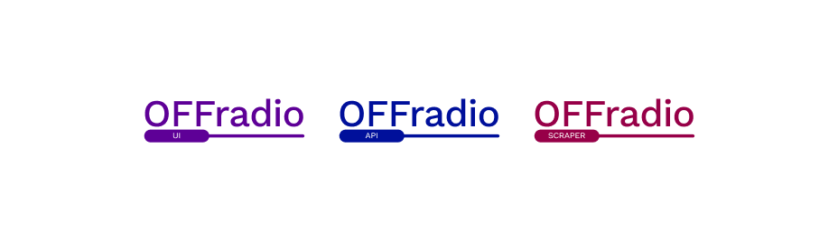

# Off Radio project

## Backstory

I often listen to [Off Radio Kraków](<(http://www.off.radiokrakow.pl)>) when I'm driving. I always find myself figuring out what is playing right now - either by Shazam or searching (yeah and remembering) the lyrics. Most of the time my girlfriend is also with me in the car so she can do this searching-stuff. And she does, and it works fine. I think best solution to that should be going to [official website](http://www.off.radiokrakow.pl) of Off Radio Kraków, specifically the _playlists_ section and just search through it to see what has aired at any desired time - assuming I didn't open up the website as soon as I've heard something interesting. So... here's the solution to that kinda-non-existing-problem of mine. You can go to [this project's website](https://off-radio.och.dev) and see what has aired. You can search and filter by artists, song, aired time. It's all I need, plus, there's historical data growing bigger and bigger. On the official website you can only see past 2 days playlists data. On my aggregator you can see past however-many-days-application-is-working.

## Getting Started

These instructions will get you a copy of the project up and running on your local machine for development and testing purposes.

### Prerequisites

- [Node.js](https://nodejs.org/en/) - latest LTS or current version
- [yarn](https://classic.yarnpkg.com/en/docs/install/) - latest version

### Installing

1. Fork, then clone the repo:

```sh
git clone https://github.com/your-username/off-radio.git
```

2. Install dependencies and link them to packages:

```sh
yarn bootstrap
```

### Development

Running the `dev` task in `packages/*` will start a development server on `localhost:300{0|1|2}`.

All dev servers support hot-reloading and auto refreshing, so you don't need to worry about hitting refresh on every change made.

```sh
yarn dev
```

### Building

Running the `build` task in `packages/*` will create a production-ready version of the specific package

```sh
yarn build
```

### Linting, formatting and testing

To run linting:

```sh
yarn lint
```

To run formatting:

```sh
yarn format
```

To run linting or formatting without writing mode:

```sh
yarn lint-dry
```

```sh
yarn format-dry
```

To run tests:

```sh
yarn test
```

## Built With

- [TypeScript](https://www.typescriptlang.org/)
- [Fastify](https://www.fastify.io) - web framework
- [Next.js](https://nextjs.org) - react framework
- [Firebase](https://firebase.google.com/) - database

...and more! See package.json for used packages.

## Contributing

Please read [CONTRIBUTING.md](CONTRIBUTING.MD) for details on the process for submitting pull requests to us.

## Versioning

We use [SemVer](http://semver.org/) for versioning. For the versions available, see the [tags on this repository](https://github.com/ochmanski/off-radio/tags).

## Authors

- **Kacper Ochmański** - _Initial work, development, structure, graphics_ - [ochmanski](https://github.com/ochmanski)

See also the list of [contributors](https://github.com/ochmanski/off-radio/contributors) who participated in this project.

## License

This project is licensed under the [CC BY-NC 4.0 License](https://creativecommons.org/licenses/by-nc/4.0/deed.pl) - see the [LICENSE.md](LICENSE.md) file for details
